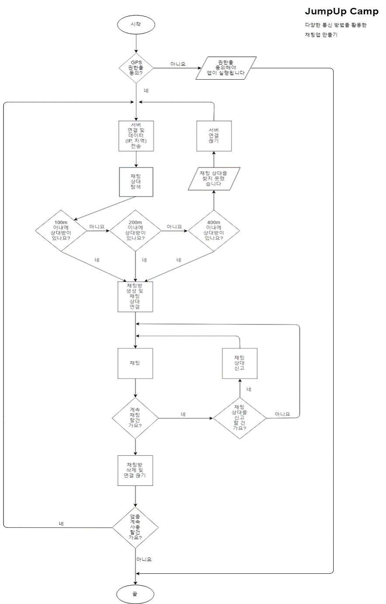

# 거리 내 랜덤 채팅 어플

Socket 통신을 통하여 동작하는 랜덤 채팅 어플이다. 타 랜덤 채팅 어플과는 다른점은 일정 거리 내에 있는 사람들 간의 랜덤 채팅이라는 점이다.

이 어플리케이션을 통하여 가까운 거리 내에 있는 사람들과 랜덤으로 채팅을 함으로써 이웃 사촌 혹은 주변 사람들과 익명으로 채팅을 하며 평상시에 마음에 담아두었던 말이나 채팅을 하면서 얻을 수 있는 재미를 느끼게 될 것이다.

-----
## 앱 개요

우선 이 앱은 위치 기반 서비스이다. 따라서 GPS 통신을 사용하기로 했고 위에 언급했다시피 Socket 통신을 이용하여 앱과 서버간의 통신이 이루어질 것이다. 이를 위하여 Socket.io라는 라이브러리를 사용하였다.

서버 측 기술로는 node.js를 사용하였고, 안드로이드는 자바를 이용하여 구성하였다.

이 앱은 첫 입장시에 서버와의 소켓 연결이 시작되고 이후 `연결하기`라는 버튼을 누름으로써 거리 내에 사람을 찾게된다. 우선 100m로 시작하여 다른 사용자를 찾고 없을 경우 200m 그 이후 400m로 늘려 찾고 400m에서도 찾지 못할 경우 연결에 실패하게된다.

혹은 연결에 성공하였을때에는 채팅을 할 수 있는 액티비티로 화면이 전환되며 채팅을 하던 도중 채팅을 중단하고 싶다면 좌측 하단의 `+`모양의 버튼을 누른 후 나가기 버튼을 누를 수 있고, 상대방이 비속어나 불쾌감을 줄 수 있는 말을 사용하였을 경우, 신고를 할 수 있는 버튼 또한 존재한다.

-----
## 앱 세부기능 분해도 
